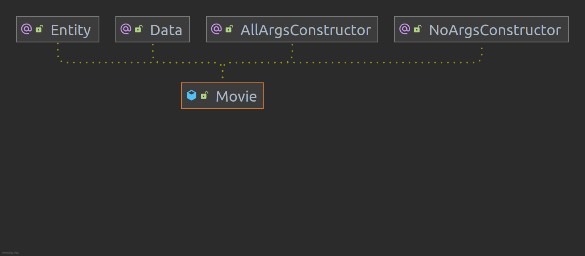
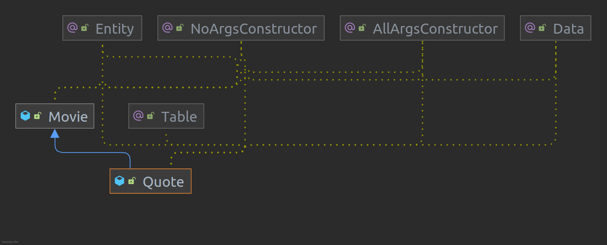
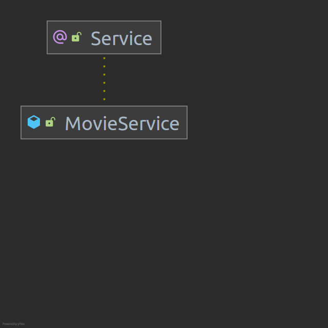
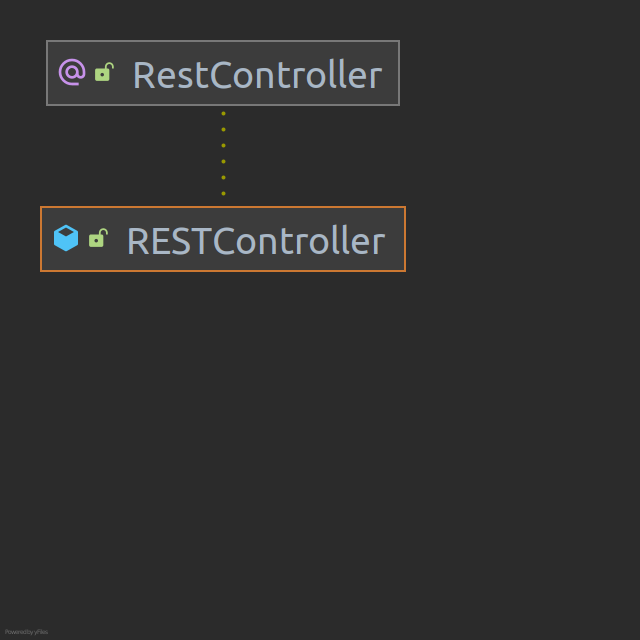
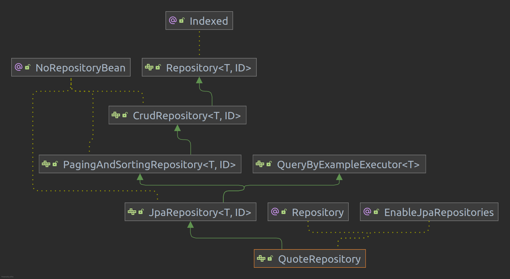

NMEC: 89123  
Nome: Tomás Candeias  
Curso: LEI  
  
Todas as notas relevantes para cada exercicio foram adiconadas na sua pasta no ficheiro readme.md  

# Questões de revisão

### A) Explain the differences between the RestController and Controller components used in different parts of this lab.  
O @Controller é a classe que prepara o modelo para ser apresentado numa view podendo escrever diretamente uma resposta utilizando o @ResponseBody, muito util para responder a pedidos de uma RESTful web service. O @Controller é utilizado para marcar uma classe como Spring MVC controller, enquanto o @RestController (engloba o @Controller e o @ResponseBody) é especialmente utilizado em RESTful web service, logo quando é usado deixa de existir a necessidade de existir uma anotação ResponseBody em cada método.  

### B) Create a visualization of the Spring Boot layers (UML diagramor similar), displaying the key abstractions in the solution of 3.3, in particular: entities, repositories, services and REST controllers.  
@Entity - define que uma classe é uma entidade que pode ser mapeada para uma tabela  
@Data - inclui as anotações @ToString, @EqualsAndHashCode, @Getter, @Setter e @RequiredArgsConstructor  
@AllArgsConstructor - gera um construtor com 1 parametro para cada variavel da classe  
@NoArgsConstructor - gera um construtor sem parametros  
@Table - permite especificar detalhes da tabela associada aquela entidade 
@Service - anota a classe na service layer  
@RestController - anota a classe como um rest controller, usado para respostas a RESTful web services  
@Repository - anota a classe que fornece mecanismos para armazenamento, busca, update/delete em objectos  








### C) Explain the annotations @Table, @Colum, @Id foundin the Employee entity.  
@Table - permite especificar detalhes da tabela associada aquela entidade, no caso do Employee define o nome da tabela da classe como "employees"  
@Colum - permite customizar o mapeamento entre os atributos da entidade e a coluna da base de dados, no caso do Employee é dito o nome da coluna a que o get está associado e define também que o valor não pode ser null.    
@Id - especifica a chave primária de uma entidade.  

### D) Explain the use of the annotation @AutoWired (in the Rest Controller class).  
O @AutoWired, por exemplo, no exercicio 3.3 diz ao springboot para arranjar um objeto do tipo MovieService. É igual fazer:  
```
@AutoWired private MovieService service;  
```
Ou,
```   
private MovieService service;  
@AutoWried public RESTController(MovieService service){this.service = service;}
```
Logo, permite-nos injetar a dependencia daquele objeto implicitamente, usando internamente um setter ou um construtor. Não pode ser usado para injetar tipos primarios ou strings.  
